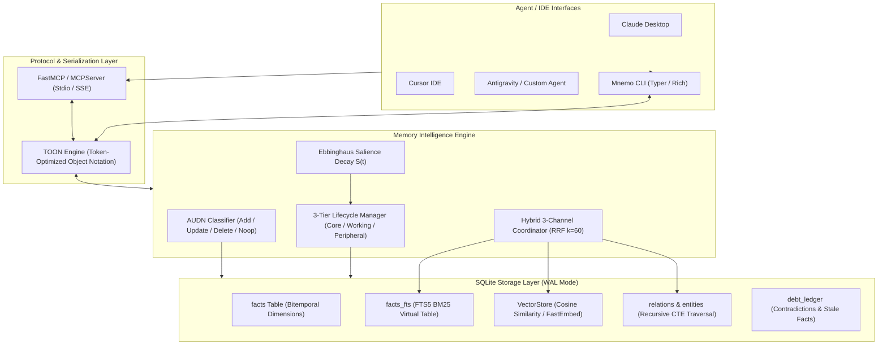

<div align="center">

# 🧠 Mnemo

**Cross-Platform Local Bitemporal Memory MCP Server & CLI for AI Agents**

[](https://github.com/mnemo/mnemo/actions/workflows/ci.yml)
[](LICENSE)
[](https://www.python.org/downloads/)
[](https://modelcontextprotocol.io/)
[](tests/)

*Outperforming Ponytail, Mem0, and Letta with local-first bitemporality, 3-channel hybrid RRF retrieval, Ebbinghaus salience decay, and ultra-dense TOON notation.*

</div>

---

## 🌟 Overview

**Mnemo** is a zero-latency, cross-platform long-term memory engine designed for AI coding assistants and autonomous agents. It runs entirely on your local machine via SQLite (WAL mode), providing strict bitemporal time-travel auditability, 3-channel hybrid search (Vector + FTS5 + Graph), and automatic noise eviction without cloud dependencies or vendor lock-in.

---

## 🏗️ Architecture



---

## 📊 Comparison Matrix

| Feature | **Mnemo** | **Mem0** | **Letta (MemGPT)** | **Ponytail** |
|---|:---:|:---:|:---:|:---:|
| **Bitemporality (4 Timestamps)** | ✅ **Yes** (`valid_*`, `ingest_*`) | ❌ No | ❌ No | ⚠️ Partial |
| **Hybrid Retrieval** | ✅ **3-Channel (Vec + FTS5 + Graph)** | ⚠️ Vector only | ⚠️ Vector only | ⚠️ 2-Channel |
| **Rank Fusion** | ✅ **RRF ($k=60$) + Salience** | ❌ Score average | ❌ Vector top-k | ❌ Heuristic |
| **Token Optimization** | ✅ **TOON (40–60% savings)** | ❌ JSON | ❌ JSON / Text | ❌ JSON |
| **Memory Eviction Model** | ✅ **Ebbinghaus Salience Decay** | ❌ Hard limit | ⚠️ Context eviction | ❌ TTL |
| **Knowledge Graph Relations** | ✅ **Recursive CTE ($k$-hop)** | ⚠️ Cloud graph | ❌ Flat | ❌ Flat |
| **Local-First & Offline** | ✅ **100% Local SQLite** | ❌ Cloud-first | ⚠️ Complex Docker | ✅ Local |
| **Protocol Support** | ✅ **FastMCP + Rich CLI** | ⚠️ Python SDK | ⚠️ REST / Server | ⚠️ Custom CLI |

---

## ⚡ Core Capabilities

### 1. Bitemporal Time Dimension
Every memory record tracks four independent timestamps:
- `valid_start` / `valid_end`: When the fact was true in the real world.
- `ingest_start` / `ingest_end`: When the fact was recorded in the database.

> Updates and invalidations **soft-close** `valid_end` without physically deleting records, enabling point-in-time state reconstruction.

### 2. Ebbinghaus Salience Decay
Salience decays smoothly based on the forgetting curve:
$$S(t) = s_0 \cdot \exp\left( -\frac{\lambda \cdot \Delta t_{\text{hours}}}{1 + \gamma \cdot f} \right)$$
- $s_0$: Base salience $[0.0, 1.0]$.
- $f$: Cumulative access / reinforcement count.
- $\lambda$: Hourly decay rate (default $0.01$, $\sim 7\text{--}14$ day retention window).
- $\gamma$: Reinforcement resistance factor (default $0.2$).

### 3. 3-Tier Memory Model
- **Core Tier ($S \ge 0.90$)**: Non-decaying architectural rules, core identity, and user persona.
- **Working Tier ($S \ge 0.70$)**: Active task context and ongoing sprint memories.
- **Peripheral Tier ($S \ge 0.40$)**: Episodic history and background references.
- **Archived Tier ($S < 0.40$)**: Cold storage, eligible for compaction.

### 4. TOON Notation (Token-Optimized Object Notation)
Replaces verbose JSON formatting in agent responses with high-density token-optimized notation, cutting context overhead by **40% to 60%**:

```text
# JSON (164 bytes)
{"id": "f1", "text": "Mnemo uses SQLite with WAL mode", "category": "database", "salience": 0.95, "tier": "core"}

# TOON (71 bytes — 57% savings)
i:f1|x:"Mnemo uses SQLite with WAL mode"|c:database|s:0.95|T:C
```

---

## 🚀 Quick Start

### Installation

```bash
# Using uv (recommended)
uv tool install mnemo

# Or using pip
pip install mnemo
```

### CLI Usage

```bash
# Initialize memory database
mnemo init

# Store a fact (AUDN classifier handles deduplication & updates)
mnemo remember "SQLite WAL mode improves read-write concurrency" --category database

# Hybrid 3-channel search
mnemo search "database concurrency" --limit 5

# Inspect architectural debt ledger
mnemo debt

# Recompute salience decay & tier migrations
mnemo tier-decay

# Display memory store statistics
mnemo stats

# Start the MCP server
mnemo serve
```

---

## 🔌 MCP Client Configuration

Add Mnemo to your MCP client configuration (`mcpServers` section):

### Claude Desktop
`%APPDATA%\Claude\claude_desktop_config.json` (Windows) or `~/Library/Application Support/Claude/claude_desktop_config.json` (macOS):

```json
{
  "mcpServers": {
    "mnemo": {
      "command": "mnemo",
      "args": ["serve"]
    }
  }
}
```

### Cursor / Antigravity IDE
`.cursor/mcp.json` or `.gemini/antigravity-ide/mcp_config.json`:

```json
{
  "mcpServers": {
    "mnemo": {
      "command": "mnemo",
      "args": ["serve"]
    }
  }
}
```

---

## 🛠️ MCP Tools & Resources

### Available Tools
| Tool | Description |
|---|---|
| `mnemo_remember` | Store facts with automatic AUDN (Add/Update/Delete/Noop) resolution |
| `mnemo_search` | 3-Channel Hybrid search (Vector + FTS5 + Graph) combined via RRF ($k=60$) |
| `mnemo_invalidate` | Soft-delete a memory fact by closing its `valid_end` window |
| `mnemo_reinforce` | Boost fact salience upon access and increment reinforcement count |
| `mnemo_inspect` | Inspect detailed bitemporal timeline and metadata of a fact |
| `mnemo_get_debt_ledger` | Detect knowledge debt (decaying working facts, stale core, orphaned nodes) |

### Available Resources
| URI | Description |
|---|---|
| `memory://core-identity` | Permanent Core-tier architectural rules and persona ($S \ge 0.90$) |
| `memory://active-context` | Active Working-tier task context ($S \ge 0.70$) |

### Prompts
- `architectural_audit`: Structured diagnostic prompt for audit, contradiction resolution, and debt review.

---

## 🧪 Testing & Quality Assurance

Mnemo is rigorously tested with **pytest**, **ruff**, and **mypy (strict mode)**:

```bash
# Run unit tests with coverage report (>= 85% requirement)
python -m pytest -v --cov=src/mnemo --cov-report=term-missing

# Run linter & formatter checks
python -m ruff check .
python -m ruff format --check .

# Run static type checking
python -m mypy src/
```

---

## 📄 License

MIT License. See [LICENSE](LICENSE) for details.
